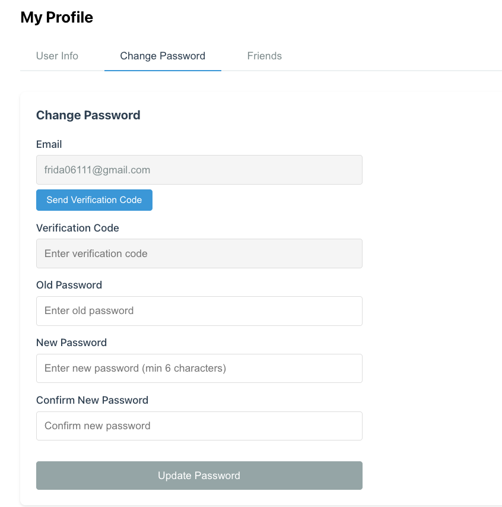

# CloudDist

A lightweight cloud storage backend built with Go, Gin, and GORM.

## Prerequisites

- Go 1.23+
- MySQL
- Redis
- AWS S3 (or S3-compatible storage like MinIO)
- Node.js 18+ (for frontend)

## Quick Start

### Backend

1. **Setup Database**
   ```bash
   mysql -u root -p < setup_db.sql
   ```

2. **Configure**
   Edit `configs/config.yaml` or set environment variables:
   ```bash
   export AWSAccessKeyID=your-access-key
   export AWSSecretAccessKey=your-secret-key
   export S3Bucket=your-bucket-name
   export AWSRegion=us-east-1
   ```

3. **Run Backend**
   ```bash
   go mod tidy
   go run ./cmd/cloud-dist/main.go -config configs/config.yaml
   ```

### Frontend

1. **Install Dependencies**
   ```bash
   cd frontend
   npm install
   ```

2. **Run Frontend**
   ```bash
   npm run dev
   ```

Visit `http://localhost:3000` to use the application.

## Full Setup Guide

See [RUN.md](./RUN.md) for detailed setup instructions including database initialization, Redis setup, and troubleshooting.

## Features

- **User Management**: Registration, login, logout with JWT authentication
- **File Storage**: Upload, download, organize files with S3 backend
- **File Management**: Create folders, rename, move, delete files
- **Sharing**: Public file sharing with expiration
- **Friend System**: Add friends, send friend requests, share files with friends
- **Token Management**: JWT-based auth with refresh tokens and blacklist support


## Architecture

- **Framework**: Gin web framework
- **ORM**: GORM
- **Storage**: AWS S3
- **Cache**: Redis (for verification codes and token blacklist)
- **Auth**: JWT tokens with Redis blacklist

## Screenshots

### Web UI





## License

MIT
