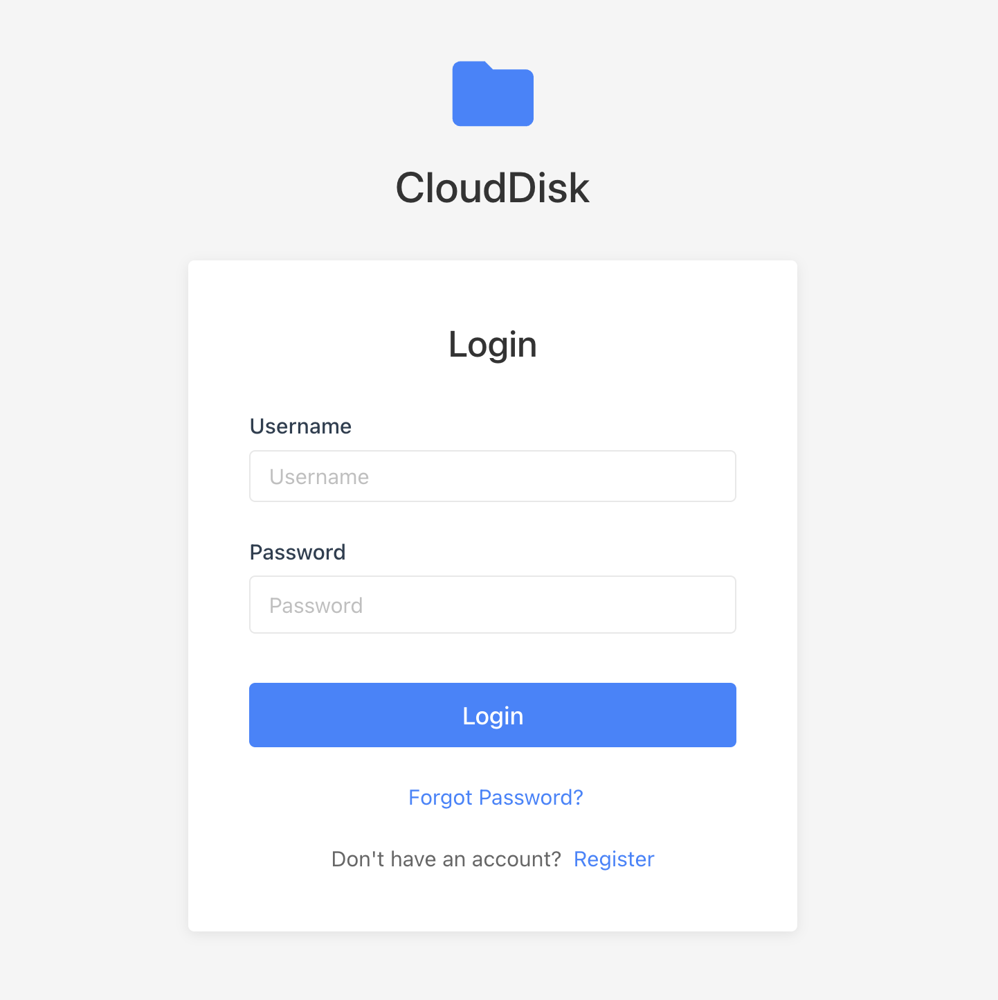
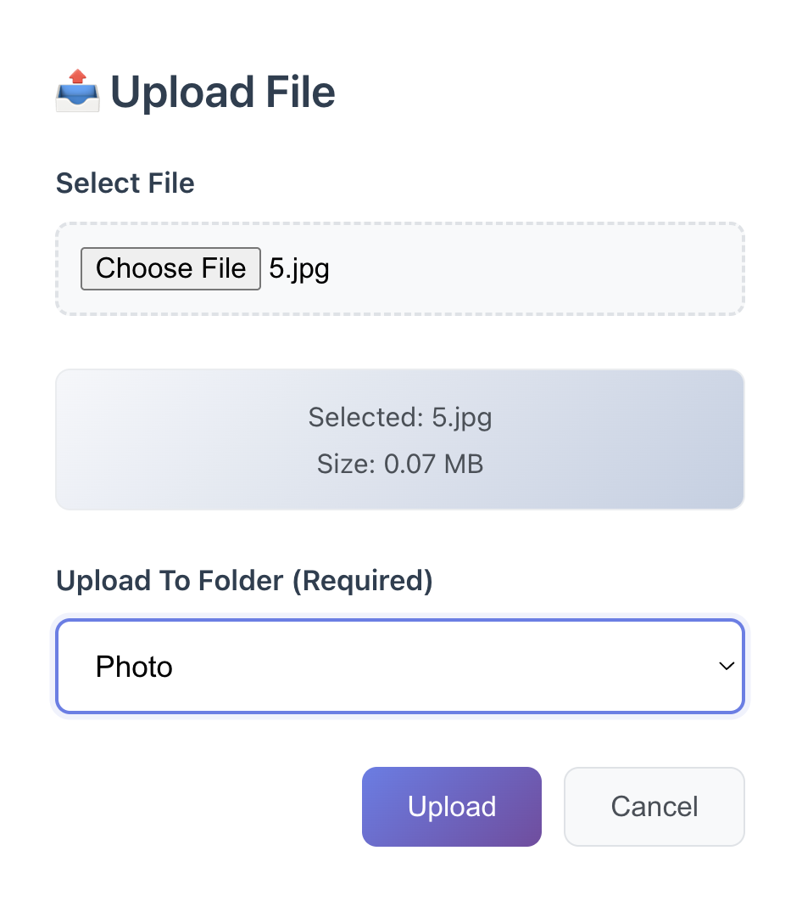

# CloudDist

A lightweight cloud storage built with Go, Gin, and GORM.

## Prerequisites

- Go 1.23+
- MySQL
- Redis
- AWS S3
- Node.js 18+ (for frontend)

## Quick Start

### One-Click Startup (Recommended)

1. **Setup Database**
   ```bash
   mysql -u root -p < setup_db.sql
   ```

2. **Install Dependencies**
   ```bash
   # Backend dependencies
   go mod tidy
   
   # Frontend dependencies
   cd frontend && npm install && cd ..
   ```

3. **Configure**
   Edit `configs/config.yaml` or set environment variables:
   ```bash
   export AWSAccessKeyID=your-access-key
   export AWSSecretAccessKey=your-secret-key
   export S3Bucket=your-bucket-name
   export AWSRegion=us-east-1
   ```

4. **Start All Services**
   ```bash
   ./start.sh
   ```
   
   This will start:
   - Backend server (http://localhost:8888)
   - Frontend dev server (http://localhost:3000)
   - Stripe CLI webhook listener

5. **Stop All Services**
   ```bash
   ./stop.sh
   ```
   
   Or press `Ctrl+C` in the terminal where `start.sh` is running.

### Manual Startup (Alternative)

If you prefer to start services separately:

**Backend:**
```bash
go run ./cmd/cloud-dist/main.go -config configs/config.yaml
```

**Frontend:**
```bash
cd frontend
npm run dev
```

**Stripe CLI (for webhook testing):**
```bash
stripe listen --forward-to localhost:8888/api/storage/purchase/webhook
```

Visit `http://localhost:3000` to use the application.


## Features

- User authentication with JWT
- File upload/download with S3 storage
- File management (folders, rename, move, delete)
- File sharing and friend system
- Storage purchase with Stripe payment

## Tech Stack

- Backend: Go, Gin, GORM
- Frontend: React, JavaScript
- Storage: AWS S3
- Cache: Redis
- Payment: Stripe

## Screenshots

    

## License

MIT
