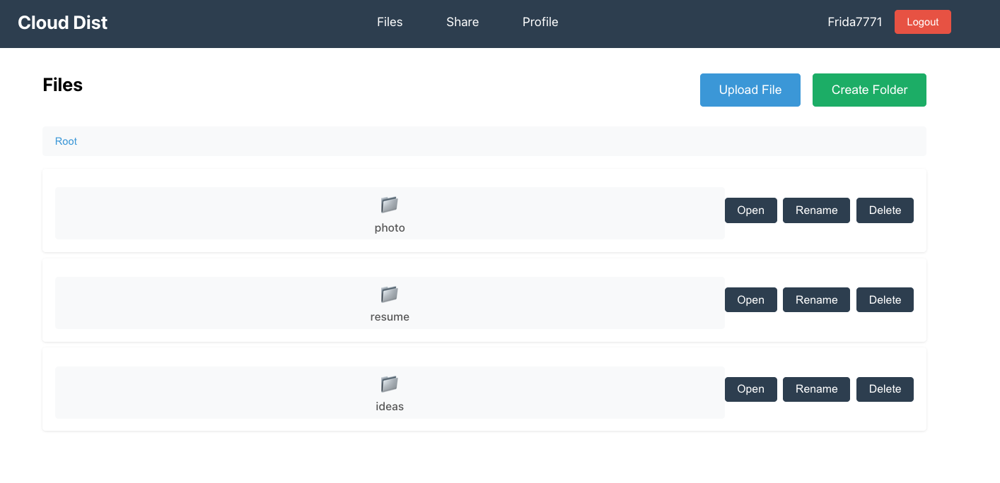
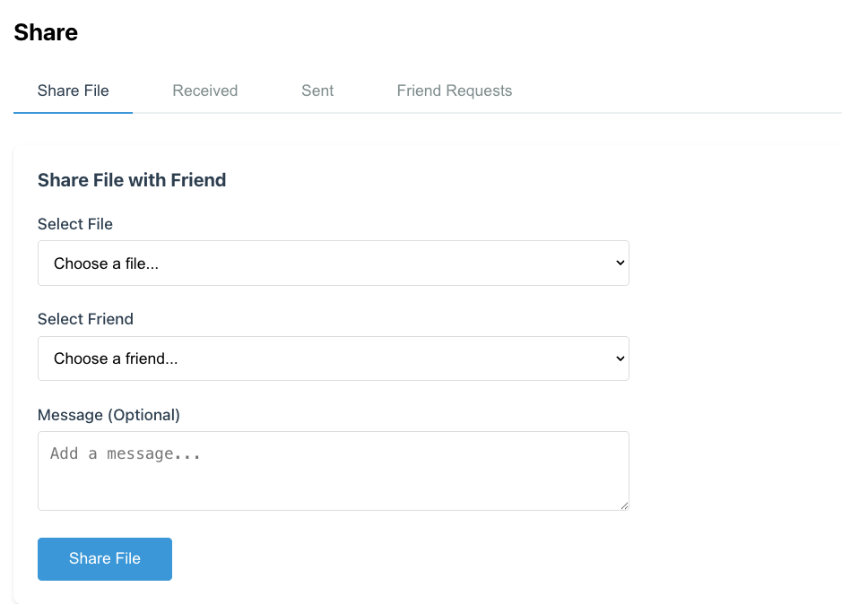
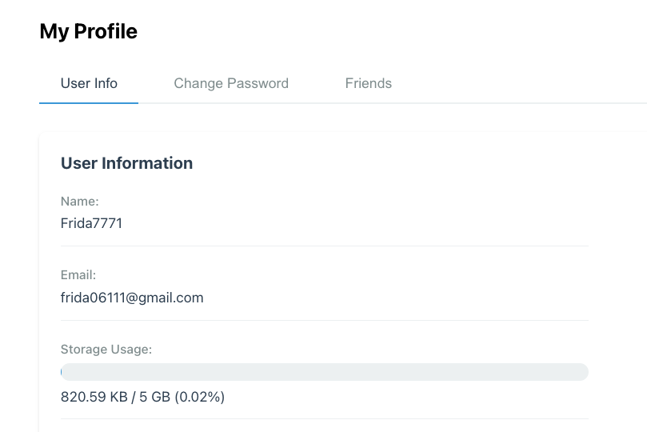
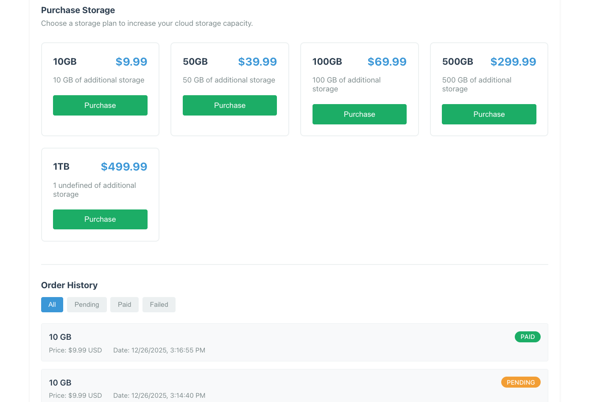

# CloudDist

A lightweight cloud storage built with Go, Gin, and GORM.

## Prerequisites

- Go 1.23+
- MySQL
- Redis
- AWS S3
- Node.js 18+ (for frontend)

## Quick Start

### Backend

1. **Setup Database**
   ```bash
   mysql -u root -p < setup_db.sql
   ```

2. **Configure**
   Edit `configs/config.yaml` or set environment variables:
   ```bash
   export AWSAccessKeyID=your-access-key
   export AWSSecretAccessKey=your-secret-key
   export S3Bucket=your-bucket-name
   export AWSRegion=us-east-1
   ```

3. **Run Backend**
   ```bash
   go mod tidy
   go run ./cmd/cloud-dist/main.go -config configs/config.yaml
   ```

### Frontend

1. **Install Dependencies**
   ```bash
   cd frontend
   npm install
   ```

2. **Run Frontend**
   ```bash
   npm run dev
   ```

Visit `http://localhost:3000` to use the application.


## Features

- User authentication with JWT
- File upload/download with S3 storage
- File management (folders, rename, move, delete)
- File sharing and friend system
- Storage purchase with Stripe payment

## Tech Stack

- Backend: Go, Gin, GORM
- Frontend: React, JavaScript
- Storage: AWS S3
- Cache: Redis
- Payment: Stripe

## Screenshots

    

## License

MIT
